# Trabajo Práctico N°4: Módulos de Kernel

Marcktm - Reyeros, Marcos Agustín

## Introducción

En el presente informe se documenta la experiencia práctica de compilar, insertar y firmar un módulo del kernel en un sistema Linux moderno, tomando como base un entorno con Secure Boot activo. Se analizaron las diferencias entre módulos y programas, los niveles de privilegio en el sistema y el uso de herramientas como `modinfo`, `strace`, y `checkinstall`.

## Desafío N°1

### Checkinstall

`checkinstall` es una herramienta que permite crear fácilmente paquetes `.deb`, `.rpm` o `.tgz` desde el proceso de compilación (habitualmente `make install`). Su objetivo principal es:

* Generar un **paquete instalable** para sistemas basados en Debian, Red Hat o Slackware.
* Facilitar la **gestión de software compilado desde código fuente** mediante el gestor de paquetes del sistema (como `dpkg`).
* Evitar que la instalación directa con `make install` ensucie el sistema, ya que se puede desinstalar el paquete fácilmente después.

> Es útil para crear módulos o herramientas personalizadas de manera ordenada y reversible.

### ¿Se animan a usarlo para empaquetar un Hello World?


* Empaquetado de un programa "hello world" con `checkinstall`

En esta sección se documenta el proceso completo para empaquetar e instalar un programa en C que imprime "Hello, world!", utilizando la herramienta `checkinstall`.

### 1. Instalación de `checkinstall`

```bash
sudo apt update
sudo apt install checkinstall
```

Se verificó que la herramienta quedó disponible y lista para su uso.


---

### 2. Creación del programa y Makefile

Se creó un archivo llamado `hello_world.c` con el siguiente contenido:

```c
#include <stdio.h>

int main() {
    printf("Hello, world!\n");
    return 0;
}
```

Luego se creó un `Makefile` compatible con `checkinstall`, el cual debe incluir una regla `install`:

```Makefile
CC = gcc
CFLAGS = -Wall

all: hello

hello: hello_world.c
	$(CC) $(CFLAGS) -o hello_world hello_world.c

install: hello
	cp hello_world /usr/local/bin/

clean:
	rm -f hello_world
```

Los archivos estan en el repositorio

---

### 3. Compilación del programa

```bash
make
```

Esto generó el binario `hello_world` exitosamente.

---

### 4. Empaquetado con `checkinstall`

```bash
sudo checkinstall
```

Durante la ejecución, se respondió a los prompts:

* Descripción del paquete: `Paquete de ejemplo que instala un programa hello world en /usr/local/bin`
* Nombre del paquete sugerido: `tp4`
* Se aceptaron los valores por defecto y se continuó con la instalación.

Salida destacada:

```
========================== Instalación exitosa ===========================
...
Creando el paquete Debian...OK
Instalando el paquete Debian...OK

 Done. The new package has been installed and saved to
 /home/marcktm/sistemasDeComputacion-TP4/TP4/tp4_20250526-1_amd64.deb
```

---

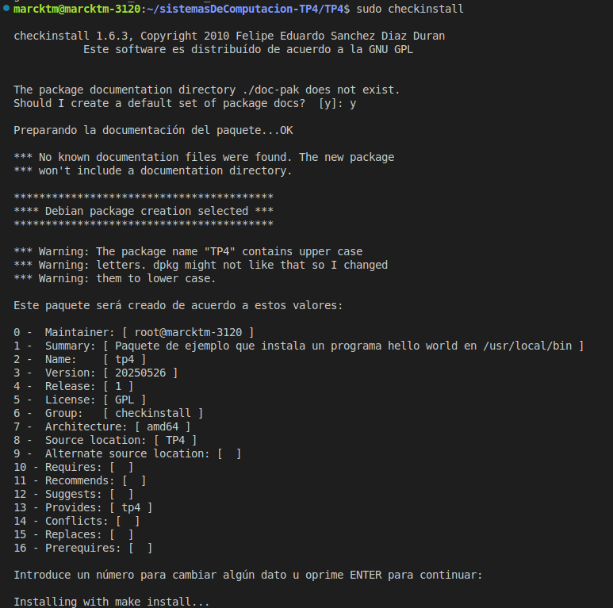
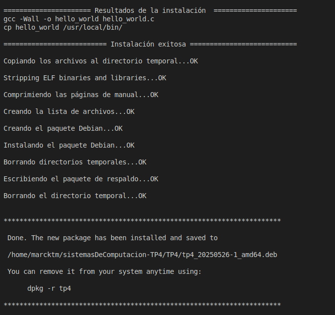

### 5. Verificación de la instalación

Se ejecutó directamente el programa desde cualquier ubicación del sistema:

```bash
hello_world
```

Salida esperada:

```
Hello, world!
```

También se verificó su ubicación:

```bash
which hello_world
# /usr/local/bin/hello_world
```
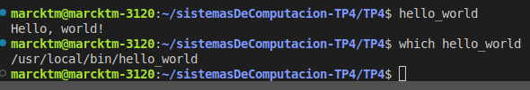

---

### 6. Desinstalación del paquete

El paquete puede eliminarse con:

```bash
sudo dpkg -r tp4
```
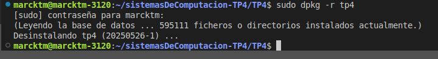

---

### Conclusión

El proceso de empaquetado con `checkinstall` permite transformar un binario generado con `make` en un paquete `.deb` fácil de instalar, compartir y desinstalar. Esta práctica es recomendable para organizar entregas de software personalizado, como en este caso, un sencillo programa en C ejecutado desde `/usr/local/bin`.

### ¿Cómo mejorar la seguridad del kernel? (Basado en la bibliografía)

Uno de los métodos clave para proteger el kernel es:

#### Firmar los módulos del kernel

* Secure Boot exige que los módulos estén firmados digitalmente.
* Esto evita que módulos maliciosos, como rootkits, se carguen sin control.
* Los rootkits son malware que se ejecuta en el espacio del kernel y puede ocultar procesos, archivos, conexiones y usuarios del sistema operativo.

> Si el módulo no está firmado con una clave reconocida por el sistema, no puede ser cargado con Secure Boot activado.

#### ¿Cómo firmar un módulo?

1. Generar par de claves (privada/pública) con OpenSSL.
2. Firmar con `sign-file` del kernel.
3. Inscribir la clave pública con `mokutil`.
4. Verificar con `modinfo` y `dmesg` que no se rechace por falta de firma.

---
## Desafío N°2 

### ¿Cómo empiezan y terminan unos y otros?

* **Programa de usuario**: comienza con la función `main()` y se ejecuta secuencialmente hasta el final del código, devolviendo el control al sistema operativo mediante un valor de retorno (`return 0` por ejemplo). Está completamente contenido en el espacio de usuario.

* **Módulo del kernel**: no posee una función `main()`. Su punto de entrada es la función registrada con `module_init()`, y su punto de salida es la función registrada con `module_exit()`. Estas funciones permiten cargar y descargar dinámicamente funcionalidades al kernel en tiempo de ejecución.

---

### ¿Qué funciones tiene disponible un programa y un módulo?

#### Programa en espacio de usuario:

Opera en un entorno restringido, usando la **librería estándar de C (glibc)** y llamadas al sistema (**syscalls**). Algunas funcionalidades clave incluyen:

* Entrada/salida con `printf`, `scanf`
* Manejo de memoria dinámica con `malloc`, `free`
* Manipulación de archivos: `fopen`, `fread`, `fwrite`, `close`
* Creación de procesos con `fork()`
* Señales, IPC y control de procesos

#### Módulo en espacio de kernel:

Opera en modo privilegiado, sin acceso a la libc. Utiliza funciones específicas del kernel:

* `printk()` en lugar de `printf`
* `kmalloc()` / `kfree()` en lugar de `malloc`
* Registro y desregistro de dispositivos
* Manejo de interrupciones y llamadas de sistema
* Control de procesos, manejo de memoria del sistema

No se puede usar `printf` o `fopen`, ya que no existen en el contexto del kernel. Los módulos interactúan directamente con estructuras y funciones internas del sistema operativo.

---

### Espacio de usuario vs. espacio del kernel

| Característica        | Espacio de Usuario | Espacio de Kernel                        |
| --------------------- | ------------------ | ---------------------------------------- |
| Privilegios           | Restringidos       | Totales                                  |
| Acceso a hardware     | No directo         | Directo                                  |
| Seguridad             | Aislado            | Expuesto, cualquier error puede colapsar |
| Librerías             | libc, libm, etc.   | Solo funciones exportadas por el kernel  |
| Contexto de ejecución | Por proceso        | Compartido por todo el sistema           |

---

### Espacio de datos y espacio de nombres

* **Espacio de datos (data segment)**: zona de memoria que contiene las variables globales y estáticas de un proceso.
* **Espacio de nombres (namespace)**: mecanismo de aislamiento usado por el kernel para separar recursos como procesos, montajes, redes, etc., utilizado en contenedores.

---

### Drivers y el contenido de `/dev`

Los **drivers** son módulos del kernel que permiten al sistema interactuar con el hardware. Cada driver registrado se asocia a un nodo especial dentro de `/dev`.

#### Tipos de dispositivos:

* **Bloque**: acceso aleatorio (ej.: `/dev/sda`)
* **Carácter**: flujo secuencial (ej.: `/dev/tty`, `/dev/random`)
* **Pseudodispositivos**: no tienen hardware físico (ej.: `/dev/null`, `/dev/zero`, `/dev/full`)

Podés explorar `/dev` con:

```bash
ls -l /dev
```

Los números **mayor\:menor** identifican el tipo de dispositivo y su número asociado al driver. Esta relación es usada por el kernel para redirigir operaciones de E/S al controlador correcto.

---

### Ejemplo con `strace` - Paso a paso

#### ¿Qué es `strace`?

Es una herramienta que te permite ver en tiempo real qué **llamadas al sistema (syscalls)** realiza un programa. Esto evidencia cómo incluso una aplicación simple interactúa con el kernel.

#### Requisitos

Instalá `strace` si no lo tenés:

```bash
sudo apt install strace
```

#### Código de ejemplo - hello_wordl.c (en el repo)

```c
#include <stdio.h>
int main() {
    printf("Hello, world!\n");
    return 0;
}
```

Compilá:

```bash
gcc hello_world.c -o hello
```

####  Trazado con `strace` detallado

```bash
strace -tt ./hello
```

```bash
marcktm@marcktm-3120:~/sistemasDeComputacion-TP4/TP4$ strace -tt ./hello
20:15:59.691345 execve("./hello", ["./hello"], 0x7ffd461cc538 /* 57 vars */) = 0
20:15:59.728005 brk(NULL)               = 0x5cb0cd056000
20:15:59.728291 mmap(NULL, 8192, PROT_READ|PROT_WRITE, MAP_PRIVATE|MAP_ANONYMOUS, -1, 0) = 0x7598b877e000
20:15:59.728909 access("/etc/ld.so.preload", R_OK) = -1 ENOENT (No existe el archivo o el directorio)
20:15:59.730594 openat(AT_FDCWD, "/etc/ld.so.cache", O_RDONLY|O_CLOEXEC) = 3
20:15:59.730933 fstat(3, {st_mode=S_IFREG|0644, st_size=83659, ...}) = 0
20:15:59.731502 mmap(NULL, 83659, PROT_READ, MAP_PRIVATE, 3, 0) = 0x7598b8769000
20:15:59.731737 close(3)                = 0
20:15:59.731915 openat(AT_FDCWD, "/lib/x86_64-linux-gnu/libc.so.6", O_RDONLY|O_CLOEXEC) = 3
20:15:59.733231 read(3, "\177ELF\2\1\1\3\0\0\0\0\0\0\0\0\3\0>\0\1\0\0\0\220\243\2\0\0\0\0\0"..., 832) = 832
20:15:59.733486 pread64(3, "\6\0\0\0\4\0\0\0@\0\0\0\0\0\0\0@\0\0\0\0\0\0\0@\0\0\0\0\0\0\0"..., 784, 64) = 784
20:15:59.733655 fstat(3, {st_mode=S_IFREG|0755, st_size=2125328, ...}) = 0
20:15:59.733793 pread64(3, "\6\0\0\0\4\0\0\0@\0\0\0\0\0\0\0@\0\0\0\0\0\0\0@\0\0\0\0\0\0\0"..., 784, 64) = 784
20:15:59.733945 mmap(NULL, 2170256, PROT_READ, MAP_PRIVATE|MAP_DENYWRITE, 3, 0) = 0x7598b8400000
20:15:59.734113 mmap(0x7598b8428000, 1605632, PROT_READ|PROT_EXEC, MAP_PRIVATE|MAP_FIXED|MAP_DENYWRITE, 3, 0x28000) = 0x7598b8428000
20:15:59.734316 mmap(0x7598b85b0000, 323584, PROT_READ, MAP_PRIVATE|MAP_FIXED|MAP_DENYWRITE, 3, 0x1b0000) = 0x7598b85b0000
20:15:59.734475 mmap(0x7598b85ff000, 24576, PROT_READ|PROT_WRITE, MAP_PRIVATE|MAP_FIXED|MAP_DENYWRITE, 3, 0x1fe000) = 0x7598b85ff000
20:15:59.734960 mmap(0x7598b8605000, 52624, PROT_READ|PROT_WRITE, MAP_PRIVATE|MAP_FIXED|MAP_ANONYMOUS, -1, 0) = 0x7598b8605000
20:15:59.735203 close(3)                = 0
20:15:59.735392 mmap(NULL, 12288, PROT_READ|PROT_WRITE, MAP_PRIVATE|MAP_ANONYMOUS, -1, 0) = 0x7598b8766000
20:15:59.735644 arch_prctl(ARCH_SET_FS, 0x7598b8766740) = 0
20:15:59.736139 set_tid_address(0x7598b8766a10) = 21265
20:15:59.736481 set_robust_list(0x7598b8766a20, 24) = 0
20:15:59.736629 rseq(0x7598b8767060, 0x20, 0, 0x53053053) = 0
20:15:59.736965 mprotect(0x7598b85ff000, 16384, PROT_READ) = 0
20:15:59.738604 mprotect(0x5cb09d6f3000, 4096, PROT_READ) = 0
20:15:59.739631 mprotect(0x7598b87b6000, 8192, PROT_READ) = 0
20:15:59.739986 prlimit64(0, RLIMIT_STACK, NULL, {rlim_cur=8192*1024, rlim_max=RLIM64_INFINITY}) = 0
20:15:59.741029 munmap(0x7598b8769000, 83659) = 0
20:15:59.741368 fstat(1, {st_mode=S_IFCHR|0620, st_rdev=makedev(0x88, 0x2), ...}) = 0
20:15:59.741894 getrandom("\x07\x5f\x02\xc4\x80\x19\x0d\x73", 8, GRND_NONBLOCK) = 8
20:15:59.742152 brk(NULL)               = 0x5cb0cd056000
20:15:59.742327 brk(0x5cb0cd077000)     = 0x5cb0cd077000
20:15:59.742515 write(1, "Hello, world!\n", 14Hello, world!
) = 14
20:15:59.742747 exit_group(0)           = ?
20:15:59.743192 +++ exited with 0 +++
marcktm@marcktm-3120:~/sistemasDeComputacion-TP4/TP4$
```

Muestra con timestamps cómo se ejecutan syscalls como `execve`, `mmap`, `openat`, `write`, `exit_group`.

#### 📊 Trazado con estadísticas

```bash
strace -c ./hello
```
```bash
marcktm@marcktm-3120:~/sistemasDeComputacion-TP4/TP4$ strace -c ./hello
Hello, world!
% time     seconds  usecs/call     calls    errors syscall
------ ----------- ----------- --------- --------- ----------------
 33,78    0,000229          28         8           mmap
 12,83    0,000087          29         3           mprotect
 11,36    0,000077          77         1           write
  7,52    0,000051          51         1           munmap
  5,90    0,000040          20         2           close
  4,57    0,000031          10         3           brk
  4,28    0,000029          14         2           openat
  3,83    0,000026           8         3           fstat
  3,69    0,000025          12         2           pread64
  2,51    0,000017          17         1           read
  2,21    0,000015          15         1           prlimit64
  1,92    0,000013          13         1           getrandom
  1,47    0,000010          10         1           arch_prctl
  1,47    0,000010          10         1           set_tid_address
  1,33    0,000009           9         1           set_robust_list
  1,33    0,000009           9         1           rseq
  0,00    0,000000           0         1         1 access
  0,00    0,000000           0         1           execve
------ ----------- ----------- --------- --------- ----------------
100,00    0,000678          19        34         1 total
marcktm@marcktm-3120:~/sistemasDeComputacion-TP4/TP4$ 

```


Muestra un resumen estadístico: cuántas veces se invocó cada syscall y cuánto tiempo tomó.


---

### Conclusión

Este resultado muestra cómo incluso una aplicación simple como printf depende del kernel para su funcionamiento básico. El programa interactúa con el sistema de archivos, bibliotecas compartidas, memoria y más, todo mediado por syscalls.

El desafío permitió comprender de forma práctica las diferencias entre programas y módulos, los espacios de ejecución, y cómo el sistema operativo actúa como intermediario incluso en tareas simples. strace evidenció que operaciones como la carga de bibliotecas, el mapeo de memoria y la escritura en pantalla están completamente gestionadas por el núcleo. Además, se constató que el entorno de ejecución de cualquier programa, por mínimo que sea, se apoya en una compleja interacción entre espacio de usuario y espacio de kernel.

Herramientas como strace ayudan a visualizar ese puente entre el espacio de usuario y el núcleo del sistema, permitiendo analizar el comportamiento y la eficiencia del sistema operativo en acción. ayudan a visualizar ese puente entre el espacio de usuario y el núcleo del sistema.

## Desafio N°3

### Paquetes obsoletos o innecesarios en sistemas modernos

Durante la preparación para compilar módulos del kernel de Linux, se encontró que algunas instrucciones clásicas están desactualizadas. En particular:

### `kernel-package` ya no se usa

* El paquete `kernel-package` **no está disponible** en versiones modernas de Ubuntu/Debian.
* Su función era generar paquetes `.deb` al compilar kernels, pero ha quedado obsoleto.
* Fue removido de los repositorios oficiales por falta de mantenimiento.


```bash
# Actualización del sistema y herramientas esenciales para compilación
sudo apt update
sudo apt install build-essential linux-headers-$(uname -r)

# (Opcional) Descargar el código fuente completo del kernel
sudo apt install linux-source
```


---

## Clonado del repositorio del TP4

Se realizó el clonado del repositorio personal donde se alojan los ejemplos de módulos para la Parte 1 del TP4:

```bash
marcktm@marcktm-3120:~$ git clone https://gitlab.com/Marcktm/kenel-modules-tp-4-marcktm.git
Clonando en 'kenel-modules-tp-4-marcktm'...
remote: Enumerating objects: 14, done.
remote: Total 14 (delta 0), reused 0 (delta 0), pack-reused 14 (from 1)
Recibiendo objetos: 100% (14/14), 4.76 KiB | 1.19 MiB/s, listo.
```

Verificación del contenido clonado:

```bash
marcktm@marcktm-3120:~$ cd kenel-modules-tp-4-marcktm/
marcktm@marcktm-3120:~/kenel-modules-tp-4-marcktm$ ls
part1  README.md
```

El contenido del repositorio incluye un directorio `part1` con los archivos fuente y `Makefile` necesarios para compilar e insertar el módulo.

---

## Compilación del módulo

Dentro del directorio `part1/module`, se ejecutó el comando `make` para compilar el módulo:

```bash
marcktm@marcktm-3120:~/kenel-modules-tp-4-marcktm/part1/module$ make
```

Salida obtenida:

```
make -C /lib/modules/6.8.0-60-generic/build M=/home/marcktm/kenel-modules-tp-4-marcktm/part1/module modules
warning: the compiler differs from the one used to build the kernel
  The kernel was built by: x86_64-linux-gnu-gcc-13 ...
  You are using:           gcc-13 ...
  ...
  LD [M]  mimodulo.ko
```

Archivos generados tras la compilación:

```bash
Makefile    mimodulo.ko   mimodulo.mod.c  mimodulo.o     Module.symvers
mimodulo.c  mimodulo.mod  mimodulo.mod.o  modules.order
```

El archivo `mimodulo.ko` es el módulo del kernel ya compilado, listo para insertarse.

---

## Inserción del módulo en el kernel

Una vez compilado, se procedió a insertar el módulo utilizando el siguiente comando:

```bash
sudo insmod mimodulo.ko
```

Verificación de los mensajes del kernel tras la inserción:

```bash
dmesg | tail
```

Resultado:

```
[18092.541926] mimodulo: loading out-of-tree module taints kernel.
[18092.541936] mimodulo: module verification failed: signature and/or required key missing - tainting kernel
[18092.542560] Modulo cargado en el kernel.
```

Verificación de carga mediante `lsmod`:

```bash
lsmod | grep mimodulo
```

Resultado:

```
mimodulo               12288  0
```

Verificación adicional en `/proc/modules`:

```bash
cat /proc/modules | grep mimodulo
```

Resultado:

```
mimodulo 12288 0 - Live 0x0000000000000000 (OE)
```

Esto confirma que el módulo fue cargado correctamente en el kernel.
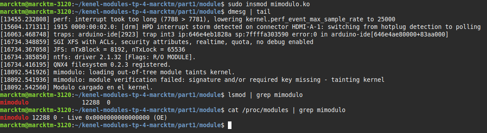

## Firma del modulo mimodulo

Para colocar una firma al modulo `mimodulo.ko`, primero se creo un certificado X509 en Shim mediante un archivo de configuración.

```bash
# certificate.cnf

HOME                    = .
RANDFILE                = $ENV::HOME/.rnd 

[ req ]
distinguished_name      = req_distinguished_name
x509_extensions         = v1
string_mask             = utf8only
prompt                  = no

[ req_distinguished_name ]
countryName             = AR
stateOrProvinceName     = Cordoba
localityName            = Cordoba
0.organizationName      = Marcos Agustín Reyeros
commonName              = Firma de módulo para Secure Boot
emailAddress            = marcos.reyeros@mi.unc.edu.ar

[ v1 ]
subjectKeyIdentifier    = hash
authorityKeyIdentifier  = keyid:always,issuer
basicConstraints        = critical,CA:FALSE
extendedKeyUsage        = codeSigning,1.3.6.1.4.1.311.10.3.6,1.3.6.1.4.1.2312.16.1.2
nsComment               = "Certificado generado por Marcos Agustín Reyeros by Marcktm"

```
Luego, se crearon las llaves privadas y publicas.


```bash
openssl req -new -x509 -newkey rsa:2048 -keyout MOK.priv \ -outform DER -out MOK.der -days 36500 -nodes -config certificate.cnf

```

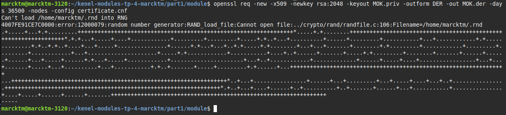

Para realizar la firma se necesitan ambas, y para "enrollar" la llave en shim se utiliza la publica (MOK.der)

```bash
sudo mokutil --import MOK.der
```

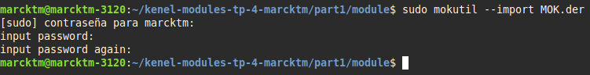

Luego se reinició la maquina y se mostró la pantalla de MokManager antes de la carga de GRUB. Aqui es donde se enrollo la llave con la clave que creamos.

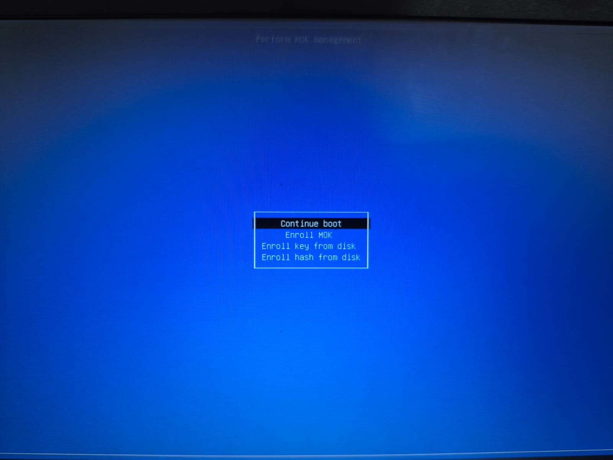
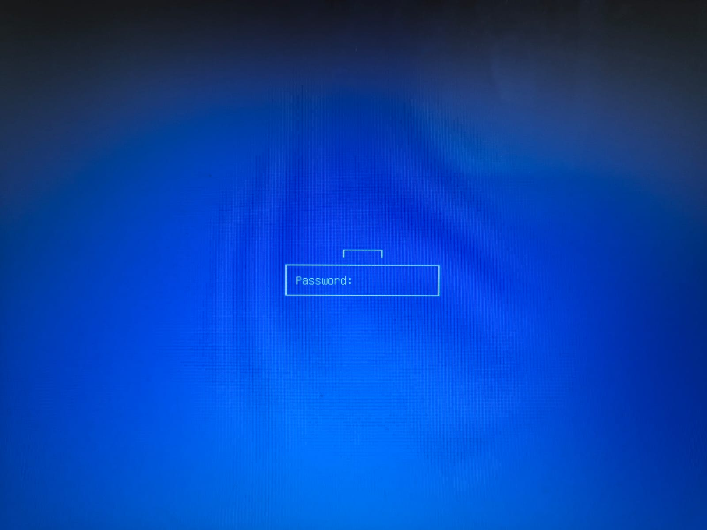
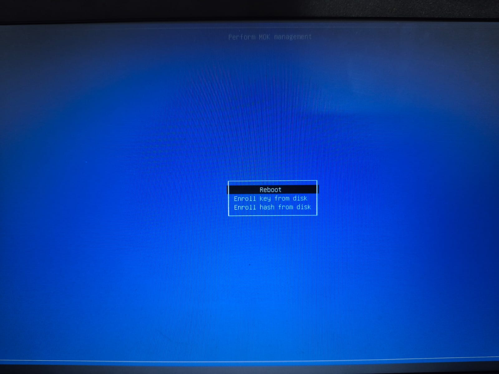
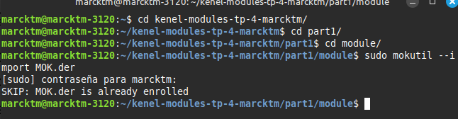


Verificacion de la firma

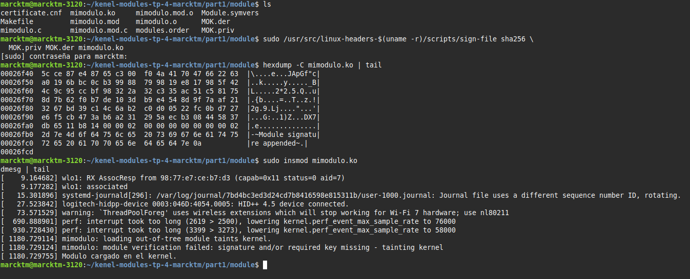

## 1) ¿Qué diferencias se pueden observar entre los dos modinfo?

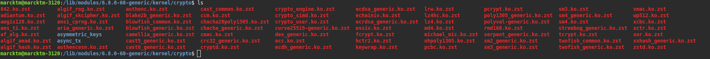
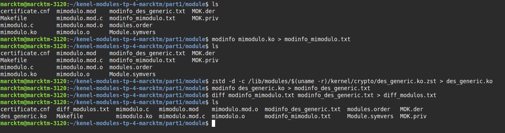


```bash
marcktm@marcktm-3120:~/kenel-modules-tp-4-marcktm/part1/module$ cat diff_modulos.txt 
1,3c1,11
< filename:       /home/marcktm/kenel-modules-tp-4-marcktm/part1/module/mimodulo.ko
< author:         Catedra de SdeC
< description:    Primer modulo ejemplo
---
> filename:       /home/marcktm/kenel-modules-tp-4-marcktm/part1/module/des_generic.ko
> alias:          crypto-des3_ede-generic
> alias:          des3_ede-generic
> alias:          crypto-des3_ede
> alias:          des3_ede
> alias:          crypto-des-generic
> alias:          des-generic
> alias:          crypto-des
> alias:          des
> author:         Dag Arne Osvik <da@osvik.no>
> description:    DES & Triple DES EDE Cipher Algorithms
5,6c13,14
< srcversion:     C6390D617B2101FB1B600A9
< depends:        
---
> srcversion:     B56606AD918CF0074D320DB
> depends:        libdes
8c16,17
< name:           mimodulo
---
> intree:         Y
> name:           des_generic
11,26c20,48
< signer:         Firma de módulo para Secure Boot
< sig_key:        23:BD:22:B7:B0:56:CA:1C:4E:3E:81:AA:74:CA:7E:9C:94:FB:AA:9B
< sig_hashalgo:   sha256
< signature:      25:DD:46:2B:34:D4:59:1A:43:17:5D:FF:76:4F:AC:18:80:50:F4:58:
< 		8E:DC:E2:EB:99:21:59:E2:92:C9:9E:D5:66:CF:F5:A8:B0:BF:1D:40:
< 		3B:6E:49:42:D2:EF:49:5A:98:9D:4E:73:B6:44:C5:43:F9:D8:D3:8A:
< 		BC:36:66:3A:0D:BE:63:84:2D:59:DD:36:1B:5A:69:3C:40:8F:CB:4D:
< 		B8:5F:35:D6:72:64:AF:1E:CC:84:E6:32:8D:A4:44:CC:3E:E9:60:82:
< 		B4:13:CE:83:74:1F:E4:07:13:E5:84:81:05:9D:AA:72:2E:81:F0:B0:
< 		33:0F:58:2A:A6:DE:77:5F:A5:BB:89:00:1B:AD:E1:83:D8:40:47:FE:
< 		CD:77:6F:AA:AF:32:DB:9A:D9:EC:5A:DD:10:55:2D:5C:CE:87:E4:87:
< 		65:C3:00:F0:4A:41:70:47:66:22:63:A0:19:6B:BC:0C:B3:99:88:79:
< 		98:19:E8:17:98:5F:42:4C:9C:95:CC:BF:98:32:2A:32:C3:35:AC:51:
< 		C5:81:75:8D:7B:62:F0:B7:DE:10:3D:B9:E4:54:8D:9F:7A:AF:21:32:
< 		67:BD:39:C1:4C:6A:B2:C0:D0:05:22:FC:0B:D7:27:E6:F5:CB:47:3A:
< 		B6:A2:31:29:5A:EC:B3:08:44:58:37:DB:65:11:B8:14
---
> signer:         Build time autogenerated kernel key
> sig_key:        6D:97:F7:E0:E3:5E:DD:23:6A:0F:B7:E7:57:F1:51:88:FD:C7:1A:3A
> sig_hashalgo:   sha512
> signature:      00:D2:BB:A1:69:DC:BA:DB:F0:97:EB:19:58:92:1E:63:4D:48:46:52:
> 		CB:7C:30:17:7B:AC:67:F7:A5:25:A9:54:9E:1F:75:82:AB:9C:BE:96:
> 		EF:B6:B2:38:76:4D:EC:51:0C:8E:27:61:24:42:60:DD:C6:1E:70:12:
> 		8B:0D:79:AA:70:29:7E:15:9F:30:7A:44:D3:FC:D5:2D:52:C6:4B:4D:
> 		91:58:68:0D:3E:23:FF:D9:E6:86:7E:3C:24:43:13:A0:7A:40:A0:A2:
> 		F6:44:FC:0D:19:A6:4E:AD:F0:E6:FA:B6:2D:A8:4C:CB:21:D4:F0:26:
> 		85:5B:5B:56:4A:4B:AB:92:80:DD:98:38:6D:F6:4B:0A:BF:94:2A:18:
> 		AE:FF:BD:DE:5C:66:B9:C8:DA:04:49:B7:17:F4:9A:35:3C:0A:80:F5:
> 		19:C5:0B:02:E3:91:94:75:9B:08:BB:CE:A4:58:61:35:6B:AE:24:DE:
> 		D2:FA:57:2C:D4:D4:2B:25:03:2F:24:77:D0:84:BF:44:DF:23:5A:3B:
> 		C0:89:30:B1:B1:1D:4B:D6:35:DC:F0:A9:57:84:64:18:50:EA:9E:CF:
> 		0F:C4:F5:9F:07:5D:AB:01:D2:8D:AD:25:68:B1:64:40:D2:03:FD:9B:
> 		96:85:58:3F:8A:71:C3:3C:73:41:8B:93:B1:CE:40:D3:82:20:40:E3:
> 		3C:6E:21:7E:4A:04:40:E1:87:D9:7B:48:3B:80:48:2D:0B:C5:60:E4:
> 		F3:48:3C:D4:13:84:E1:00:F4:28:8D:D4:3E:01:12:1A:04:5B:E9:B7:
> 		E0:22:BC:8D:0C:10:21:88:77:5F:D4:25:2F:26:06:A7:A0:46:37:6D:
> 		A8:99:5D:78:28:8B:34:5C:15:A9:4F:60:37:83:28:93:12:17:55:07:
> 		27:4A:53:30:B6:43:E9:C4:CE:B0:55:B0:A9:65:5A:EB:DD:3A:95:1F:
> 		78:95:1A:5C:6E:C5:49:FF:FE:F5:13:33:E6:2F:47:3A:B5:41:1B:06:
> 		07:AB:E0:7C:16:4D:95:8A:D7:1D:7D:97:8F:EE:1C:76:9D:FA:02:8C:
> 		F0:92:F9:8E:2D:90:42:BB:3B:F1:24:AD:98:AC:E4:77:DF:8C:A3:1F:
> 		96:A1:C5:EA:F2:C1:6F:7C:D2:FC:52:25:8F:27:35:6F:04:1A:BF:72:
> 		0C:1D:44:70:18:00:09:92:86:AD:44:62:AA:9A:D4:D0:D2:01:00:06:
> 		50:11:24:47:C3:3E:EE:1B:8D:F1:54:64:CF:FA:5D:9C:24:ED:D5:B9:
> 		CD:C2:4E:3E:07:09:38:71:71:0C:A1:F1:11:82:E5:2E:0E:5D:A1:DB:
> 		81:17:02:77:45:75:C5:F3:0B:FA:DA:07
marcktm@marcktm-3120:~/kenel-modules-tp-4-marcktm/part1/module$ 


```

## Comparación entre módulos del kernel (`mimodulo.ko` vs `des_generic.ko`)

Se compararon los metadatos de los módulos del kernel usando `modinfo`. Los resultados están documentados en `diff_modulos.txt`, generado con el siguiente comando:

```bash
diff modinfo_mimodulo.txt modinfo_des_generic.txt > diff_modulos.txt
```

### Principales diferencias observadas:

| Aspecto                         | `mimodulo.ko` (propio)                                 | `des_generic.ko` (oficial del sistema)                   |
|----------------------------------|--------------------------------------------------------|----------------------------------------------------------|
| **Ubicación**                    | Directorio del proyecto local                          | `/lib/modules/.../kernel/crypto/des_generic.ko`         |
| **Autor y descripción**         | Autor: Cátedra de SdeC<br>Descripción: Ejemplo simple  | Autor: Dag Arne Osvik<br>Descripción: Algoritmos DES    |
| **Alias**                       | No posee                                               | Tiene múltiples alias (ej: `des`, `crypto-des`)         |
| **Dependencias (`depends`)**    | Ninguna                                                | Depende de `libdes`                                     |
| **Metadato `intree`**           | No                                                     | Sí (`Y`)                                                 |
| **Firma digital (`signer`)**    | "Firma de módulo para Secure Boot" (propia)            | "Build time autogenerated kernel key" (kernel oficial)  |
| **Algoritmo de firma**          | SHA256                                                 | SHA512                                                   |
| **Campo `srcversion`**          | Presente                                               | Presente                                                 |
| **Campo `retpoline`**           | No                                                     | Sí (`Y`)                                                 |
| **Tamaño y longitud de firma**  | Menor                                                  | Mucho más extensa y robusta                             |

### Archivos involucrados:
- `modinfo_mimodulo.txt`
- `modinfo_des_generic.txt`
- `diff_modulos.txt`

## 2) ¿Qué divers/modulos estan cargados en sus propias pc?

[MODULOS Reyeros, Marcos Agustín](./TP4/modules_marcos.txt)

## 3) ¿Cuales no están cargados pero están disponibles? que pasa cuando el driver de un dispositivo no está disponible. 

Estos módulos existen en el sistema pero no están activos (no están cargados en el kernel). Para verlos:

### Buscamos todos los módulos disponibles en el sistema y lo guardamos en un txt

```bash
find /lib/modules/$(uname -r) -type f -name "*.ko*" | xargs -n1 basename | sed 's/\.ko.*$//' | sort > modules_disponibles.txt
```

### Obtenemos los módulos actualmente cargados (en el kernel) y los guardamos en un txt

```bash
lsmod | tail -n +2 | awk '{print $1}' | sort > modules_cargados.txt
```

### Comparamos los dos archivos para ver qué módulos están disponibles pero no cargados y no estan cargados

## Módulos disponibles pero no cargados

Se compararon los módulos listados en `modules_disponibles.txt` (disponibles en el sistema) con los efectivamente activos según `modules_cargados.txt`. La comparación se realizó con el comando:

```bash
comm -23 modules_disponibles.txt modules_cargados.txt > modules_disponibles_no_cargados.txt
```

Esto nos dio como resultado una lista extensa de módulos que están disponibles en el sistema pero que no han sido cargados en el kernel, ya sea porque el hardware asociado no está presente o porque no son necesarios en la sesión actual. Algunos ejemplos incluyen:

- `batman-adv`
- `dm-crypt`
- `e1000`
- `dvb_usb_v2`
- `cp210x`

### ¿Qué ocurre si un módulo no está disponible?

Cuando un módulo no está disponible en el sistema (ni cargado ni presente en `/lib/modules/`), el dispositivo correspondiente no podrá funcionar. Esto puede provocar la falta de conexión de red, sonido, o que no se reconozca cierto hardware. Para solucionarlo, se pueden instalar los paquetes que contienen dichos drivers, o en casos específicos, compilar el módulo a mano.

**Ejemplos de soluciones:**

- `sudo apt install firmware-realtek`
- Compilar manualmente desde el código fuente del fabricante

## Correr hwinfo en una pc real con hw real y agregar la url de la información de hw en el reporte. 

Instalamos `hwinfo`

```bash
sudo apt update
sudo apt install hwinfo
```

Ejecutamos `hwinfo` y guardamos la salida en un archivo 

```bash
hwinfo --short > hwinfo_salida.txt
```
```bash
cpu:
                       Intel(R) Celeron(R) N5100 @ 1.10GHz, 2800 MHz
                       Intel(R) Celeron(R) N5100 @ 1.10GHz, 2800 MHz
                       Intel(R) Celeron(R) N5100 @ 1.10GHz, 2800 MHz
                       Intel(R) Celeron(R) N5100 @ 1.10GHz, 2800 MHz
keyboard:
                       Logitech Unifying Receiver
  /dev/input/event4    AT Translated Set 2 keyboard
mouse:
                       Logitech Unifying Receiver
  /dev/input/mice      DELL0A33:00 04F3:3082 Mouse
  /dev/input/mice      DELL0A33:00 04F3:3082 Touchpad
monitor:
                       SM24
                       TCP4G 116BGE LCD Monitor
graphics card:
                       Intel JasperLake [UHD Graphics]
sound:
                       Intel Audio device
storage:
                       Kingston Technology Company OM3PDP3 NVMe SSD
network:
  wlo1                 Intel Wi-Fi 6 AX201 160MHz
network interface:
  wlo1                 Ethernet network interface
  lo                   Loopback network interface
disk:
  /dev/nvme0n1         Kingston Technology Company OM3PDP3 NVMe SSD
partition:
  /dev/nvme0n1p1       Partition
  /dev/nvme0n1p2       Partition
  /dev/nvme0n1p3       Partition
  /dev/nvme0n1p4       Partition
usb controller:
                       Intel USB Controller
bios:
                       BIOS
bridge:
                       Intel PCI bridge
                       Intel ISA bridge
                       Intel Host bridge
hub:
                       Linux Foundation 2.0 root hub
                       Linux Foundation 3.0 root hub
memory:
                       Main Memory
bluetooth:
                       Intel Bluetooth 9460/9560 Jefferson Peak (JfP)
unknown:
                       FPU
                       DMA controller
                       PIC
                       Keyboard controller
                       Intel System peripheral
                       Intel Serial IO I2C Host Controller
                       Intel Dynamic Tuning service
                       Intel Management Engine Interface
                       Intel JaserLake SPI (flash) Controller
                       Intel Serial bus controller
                       Intel Serial IO I2C Host Controller
                       Intel RAM memory
                       Intel JaserLake SMBus
                       Intel JasperLake IPU
                       Realtek Integrated_Webcam_HD
```

Subimos el archivo a termbin (una herramienta online para compartir logs)


```bash
cat hwinfo_salida.txt | nc termbin.com 9999
```

[https://termbin.com/jlek](https://termbin.com/jlek)

## 5) ¿Qué diferencia existe entre un módulo y un programa  ? 

En sistemas operativos como Linux, los **módulos del kernel** y los **programas de usuario** tienen roles, privilegios y comportamientos muy distintos. A continuación se detallan sus diferencias más relevantes:

### Módulo del Kernel

Un **módulo del kernel** es una pieza de código que se puede cargar y descargar dinámicamente en el núcleo del sistema operativo, sin necesidad de reiniciar el sistema. Permite extender las funcionalidades del kernel.

#### Características:
- Se ejecuta en **modo kernel (kernel space)**, con privilegios elevados.
- Se carga con herramientas como `insmod` o `modprobe`.
- Tiene acceso directo a recursos críticos del sistema y al hardware.
- Se utiliza para:
  - Agregar soporte para nuevos **dispositivos** (drivers).
  - Incorporar nuevos **sistemas de archivos**, protocolos de red, etc.
- Un error en el código del módulo puede **afectar a todo el sistema** o generar un **kernel panic**.
- No se ejecuta como proceso, no tiene `main()`, sino funciones especiales como `module_init()` y `module_exit()`.

### Programa de Usuario

Un **programa de usuario** es una aplicación que se ejecuta en el espacio de usuario (user space) y realiza tareas específicas para el usuario o el sistema, como navegadores, editores de texto, comandos de terminal, etc.

#### Características:
- Se ejecuta en **modo usuario (user space)**, con acceso restringido al sistema.
- Corre como un proceso aislado, protegido por el sistema operativo.
- Utiliza funciones de bibliotecas como `libc` y hace llamadas al sistema (`syscalls`) para interactuar con el kernel (por ejemplo, `read()`, `write()`, `open()`).
- Se desarrolla usando funciones como `main()`, `printf()`, `malloc()`, etc.
- En caso de error, el sistema lo puede finalizar sin comprometer la estabilidad general (por ejemplo, `segmentation fault`).

---

### Comparación resumida

| Característica                  | Módulo del Kernel                    | Programa de Usuario                  |
|----------------------------------|--------------------------------------|--------------------------------------|
| Espacio de ejecución             | Kernel Space                         | User Space                           |
| Nivel de privilegio              | Elevado                              | Restringido                          |
| Puede acceder directamente al HW | Sí                                   | No (a través de syscalls)            |
| Impacto ante errores             | Alto (puede colapsar el sistema)     | Bajo (solo afecta su propio proceso) |
| Funciones típicas                | `module_init()`, `module_exit()`     | `main()`, `printf()`, etc.           |
| Interacción con el SO            | Directa                              | A través de llamadas al sistema      |
| Ejecución                        | No es un proceso                     | Se ejecuta como proceso              |

---

### Conclusión

Los módulos del kernel permiten extender el sistema operativo a bajo nivel, con acceso total al hardware y estructuras internas, mientras que los programas de usuario trabajan en un entorno controlado, comunicándose con el kernel mediante interfaces bien definidas. Ambos son fundamentales para el funcionamiento del sistema, pero operan en capas diferentes y con propósitos distintos.

## 6) ¿Cómo puede ver una lista de las llamadas al sistema que realiza un simple hello world en C?

En sistemas Linux, una de las herramientas más útiles para analizar qué hace internamente un programa es **`strace`**. Esta herramienta permite **interceptar y mostrar todas las llamadas al sistema (syscalls)** realizadas por un proceso en tiempo de ejecución.

### Ejemplo práctico: hello world en C

#### Código fuente (`hello.c`)
```c
#include <stdio.h>

int main() {
    printf("Hello, world!\n");
    return 0;
}
```

#### Compilación:
```bash
gcc hello.c -o hello
```

#### Ejecución con `strace`:
```bash
strace ./hello
```

Esto imprimirá una salida extensa que incluye llamadas como:
- `execve()` → ejecución del programa
- `write()` → impresión en pantalla
- `open()`, `read()`, `close()` → interacción con bibliotecas y archivos del sistema
- `mmap()`, `brk()` → gestión de memoria

También se puede usar:

```bash
strace -c ./hello
```

para obtener un **resumen estadístico**, como:
```
% time     seconds  usecs/call     calls    errors syscall
------ ----------- ----------- --------- --------- ----------------
 35.00    0.000123          41         3           write
 25.00    0.000088          29         3           openat
 20.00    0.000070          23         3           close
 ...
```

### ¿Por qué es útil?

`strace` revela la interacción entre un programa y el sistema operativo. Incluso un simple `printf()` requiere varias llamadas al sistema para:
- Abrir bibliotecas compartidas,
- Reservar memoria,
- Escribir en pantalla,
- Cerrar archivos al finalizar.

Esto demuestra que los **programas en espacio de usuario dependen del kernel para ejecutar sus tareas**, incluso las más simples.

### Conclusión

Usar `strace` con programas simples como `hello world` es una excelente forma de comprender el funcionamiento interno del sistema operativo y el rol de las **syscalls como puente entre los programas y el kernel**.

### 7. ¿Qué es un segmentation fault? ¿Cómo lo maneja el kernel y cómo lo hace un programa?

Un **segmentation fault** (también conocido como **segfault**) es un error que ocurre cuando un programa intenta acceder a una parte de la memoria que no le corresponde. Es algo así como cuando alguien intenta entrar a una habitación con llave sin permiso: el sistema se da cuenta y lo frena.

#### ¿Cuándo pasa?

Puede pasar, por ejemplo:
- Cuando tratamos de usar un puntero que no fue inicializado (como un `NULL`).
- Cuando intentamos leer o escribir fuera de los límites de un array.
- Si liberamos memoria y después la queremos volver a usar.
- O incluso si escribimos en una parte de memoria que está marcada como "solo lectura".

#### ¿Qué hace el kernel cuando pasa esto?

El sistema operativo (el kernel, para ser más preciso) se encarga de controlar qué parte de la memoria puede usar cada programa. Si un programa se quiere meter en una zona que no le corresponde, el kernel **lo detecta enseguida** y le manda una señal llamada `SIGSEGV` (por “segmentation violation”).

Cuando eso pasa, el programa se cierra automáticamente. A veces se genera un "core dump", que es un archivo que nos puede servir para investigar qué fue lo que falló, por ejemplo con herramientas como `gdb`.

#### ¿Y qué puede hacer el programa?

Un programa, si quiere, puede "atrapar" esa señal con funciones como `signal()` o `sigaction()` y hacer algo antes de morir, como:
- Mostrar un mensaje personalizado.
- Guardar un archivo de log.
- O cerrar recursos abiertos correctamente.

Pero **no es buena idea tratar de seguir ejecutando el programa después de un segmentation fault**, porque es muy probable que haya quedado inestable o con datos corruptos.

#### ¿Para qué sirve esto?

Aunque parezca un problema grave (¡y lo es si programamos mal!), en realidad es una **medida de protección muy importante**. Sirve para:
- Evitar que un programa dañe el sistema o a otros programas.
- Ayudarnos a detectar errores en el código.
- Mantener aislado el funcionamiento de cada aplicación.

#### Ejemplo simple:

```c
int main() {
    int *p = NULL;
    *p = 10;  // ¡BOOM! segmentation fault
    return 0;
}
```

Ese programa va a fallar porque intenta escribir en una dirección de memoria que no está habilitada.

### 9) Agregar evidencia de la compilación, carga y descarga de su propio módulo imprimiendo el nombre del equipo en los registros del kernel. 

Primero dejamos evidencia con una carpeta llamada `module` dode se va a guardar mi archivo `marckModulo.c` y su `Makefile` y luego mostramos la consola

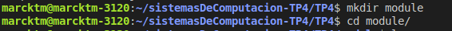

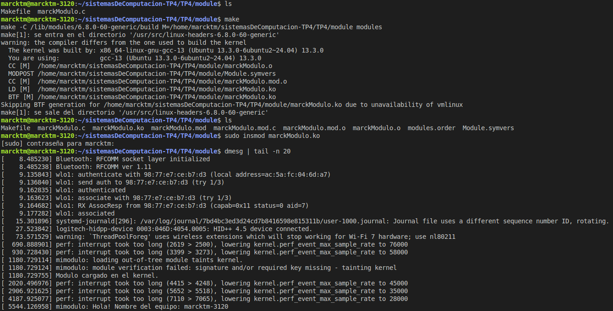

### Verificamos la carga

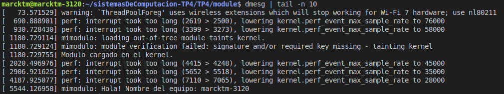

### Verificamos la descarga (chau chau)

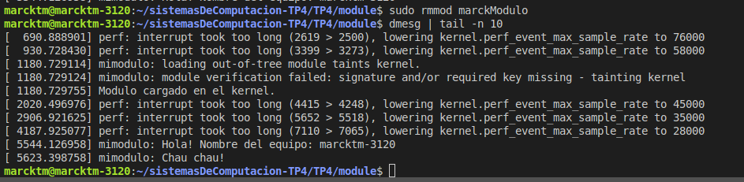

## 10. ¿Qué pasa si mi compañero con Secure Boot habilitado intenta cargar un módulo firmado por mí?

Si yo le paso a mi compañero un módulo que firmé yo mismo, y él tiene **Secure Boot activado**, el sistema **no va a dejar cargarlo**. ¿Por qué? Porque Secure Boot solo acepta módulos firmados por claves que estén registradas como "confiables" en su sistema.

Como mi clave privada no está en esa lista, el módulo se considera inseguro, aunque yo lo haya firmado. Para poder cargarlo, él tendría que hacer una de estas dos cosas:

- **Desactivar Secure Boot**, lo cual no es lo ideal porque baja la seguridad del sistema.
- **Registrar mi clave pública (el archivo .der) usando MokManager**, así el sistema acepta mis firmas como válidas.

---

## 11. Sobre el parche de Microsoft y Secure Boot

### a) ¿Cuál fue la consecuencia del parche de Microsoft en sistemas con Linux y Windows?

El parche que lanzó Microsoft para GRUB (el gestor de arranque) fue para tapar una vulnerabilidad seria (calificada con 8.6 sobre 10). Pero lo que terminó pasando fue que **muchos usuarios con arranque dual (Linux y Windows)** tuvieron problemas para iniciar Linux. En algunos casos, directamente no arrancaba o aparecían errores porque se rompía la validación del arranque seguro (Secure Boot).

---

### b) ¿Qué implica desactivar Secure Boot como solución?

Si bien desactivar Secure Boot puede hacer que todo vuelva a arrancar normalmente, también **deja la computadora más vulnerable**. Porque sin esa protección, el sistema ya no verifica que lo que se carga al inicio esté firmado o validado. Entonces, cualquier software malicioso (como rootkits) podría ejecutarse antes de que el sistema operativo arranque por completo.

Es decir, sirve como parche temporal, pero **no es recomendable dejarlo desactivado para siempre**.

---

### c) ¿Cuál es el objetivo principal del Secure Boot?

Secure Boot está pensado para que **solo se cargue software que haya sido firmado por alguien en quien el sistema confía**, como el fabricante del equipo o el desarrollador del sistema operativo. Esto evita que se metan virus o códigos maliciosos apenas prende la computadora.

Funciona como una barrera de seguridad justo al inicio del arranque. Si detecta algo sospechoso o no firmado, **bloquea la carga automáticamente**.

## Conclusión Final

El desarrollo de este trabajo práctico permitió comprender de manera profunda y aplicada el funcionamiento interno del kernel de Linux, sus mecanismos de seguridad como Secure Boot, y la forma en que los módulos interactúan con el sistema.

A lo largo del informe se realizaron múltiples desafíos que incluyeron la compilación de un módulo personalizado, su inserción y remoción, el proceso de firma digital, y la validación a través de herramientas como `modinfo`, `strace`, `lsmod`, `dmesg` y `hwinfo`. Estas experiencias no solo fortalecieron los conocimientos técnicos, sino que también destacaron la importancia de comprender la estructura de bajo nivel del sistema operativo.

Puntos clave que se consolidaron:

- **Diferencia entre programas y módulos**: se evidenció cómo los programas operan en espacio de usuario con restricciones, mientras que los módulos lo hacen en espacio de kernel, con acceso completo al hardware y recursos del sistema.

- **Importancia de la firma de módulos**: se experimentó el proceso de firmar un módulo y registrarlo en el entorno de arranque seguro, entendiendo que Secure Boot bloquea cualquier carga que no esté firmada con claves confiables.

- **Impacto de Secure Boot**: se exploraron los efectos del mismo en la carga de módulos de terceros, y se analizaron las implicancias del parche de Microsoft que afectó sistemas dual-boot con GRUB.

- **Análisis de hardware real**: se aplicaron herramientas para conocer los drivers activos y disponibles, y se comparó la configuración entre distintos entornos, reforzando la capacidad de diagnóstico de compatibilidad de hardware.

En definitiva, este trabajo permitió articular teoría y práctica para desarrollar una comprensión real del funcionamiento del kernel y sus módulos. Además, facilitó el desarrollo de habilidades clave como el manejo de herramientas de debugging, firma criptográfica, y análisis de llamadas al sistema. Todo esto se realizó en un entorno actual, con versiones recientes del kernel y herramientas, preparando al alumno para escenarios reales de administración y desarrollo sobre sistemas Linux.

---
